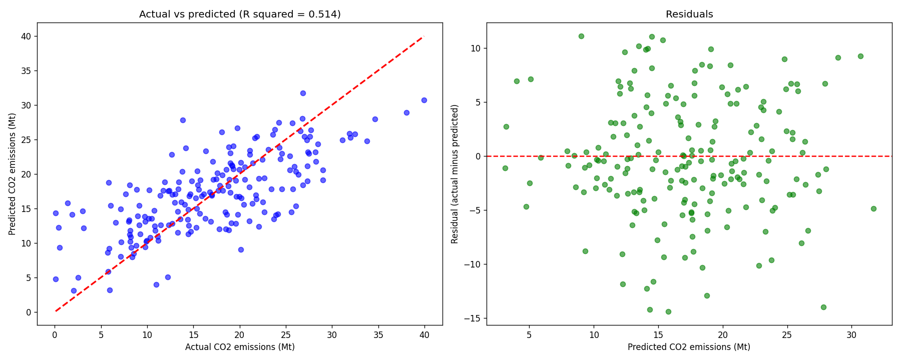
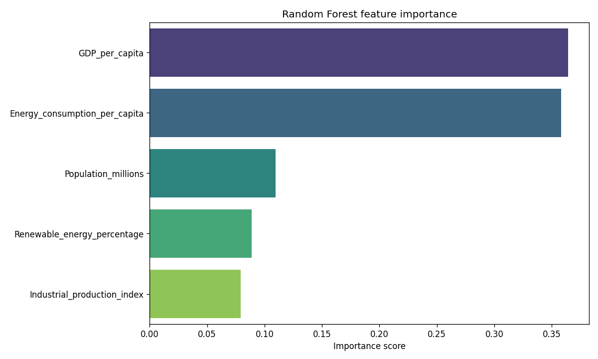

# CO2 Emission Predictor

A Random Forest model that predicts a country's CO2 emissions from five
economic and energy indicators: GDP per capita, population, energy use per
person, share of renewable energy and industrial production. I built it for a
project on UN Sustainable Development Goal 13, Climate Action.

**The model is trained on synthetic data.** The script generates 1000 records
with numpy. It does not use measured country data. The scores below describe
how well the model fits that generated data, not how well it would predict
real emissions. Do not use it for policy decisions.

## Who it is for

Students and anyone learning how to build and evaluate a regression model in
scikit-learn, from data to charts.

## How to run it

```bash
pip install -r requirements.txt
python co2_predictor.py
```

Charts go to the `charts/` folder. Add `--show` to open each one in a window
as well.

## What I built

- A generator for the synthetic dataset, with a fixed seed so every run gives
  the same numbers
- An 80/20 train and test split
- A Random Forest regressor, with linear regression as a baseline to compare
  against
- Scores for both models: mean absolute error, root mean squared error and
  R squared
- Charts of the data, feature importance, actual against predicted values and
  predictions for three made-up country profiles

Built with Python, pandas, numpy, scikit-learn, matplotlib and seaborn.

## Results

Scores on the 20 percent test set, from running the current script:

| Model | MAE (Mt) | RMSE (Mt) | R squared |
|---|---|---|---|
| Random Forest | 4.29 | 5.43 | 0.514 |
| Linear regression | 4.19 | 5.17 | 0.560 |

The script builds CO2 as a straight line through the five features plus random
noise. That is why the linear model scores higher than the Random Forest, and
why neither gets far past an R squared of 0.5.





## What I learned

[FILL IN: two or three sentences in your own words. For example: why the
linear model beat the Random Forest here, what the constant population bug
taught you about checking your data, or what changes if you swap in real data
from Our World in Data.]

## Author

Rehumile Sechele, rehumiles@gmail.com
